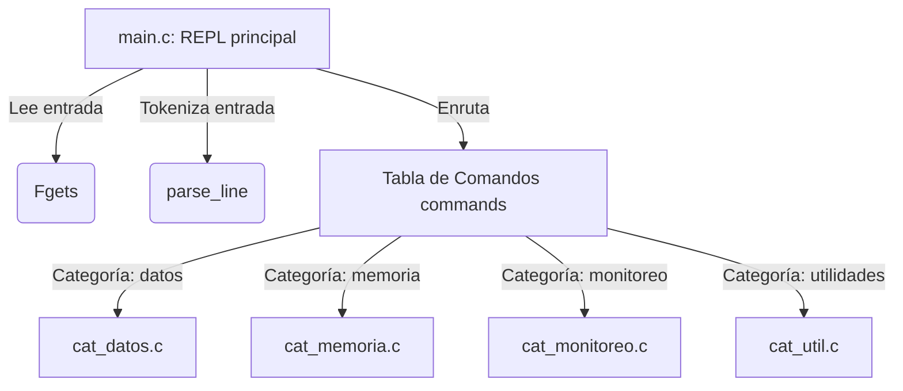

# Guía Didáctica: Arquitectura del Shell Educativo y Llamadas al Sistema

Esta guía está diseñada para los estudiantes de la asignatura **SO2026B (Sistemas Operativos)**. Explica detalladamente la arquitectura del proyecto `sys_shell`, el flujo de ejecución del shell interactivo y los conceptos de bajo nivel asociados a cada llamada al sistema (*syscall*) utilizada.

---

## 1. Concepto Fundamental: Espacio de Usuario vs. Espacio de Kernel

En los sistemas operativos modernos (como Linux), el procesador opera en al menos dos modos de ejecución para garantizar la seguridad y estabilidad del sistema:

*   **Espacio de Usuario (User Space)**: Modo de baja prioridad. Los programas ordinarios (como nuestro shell) se ejecutan aquí. No pueden acceder directamente al hardware ni a la memoria física de otros procesos.
*   **Espacio de Kernel (Kernel Space)**: Modo de alta prioridad. El núcleo del sistema operativo se ejecuta aquí y tiene control absoluto sobre el hardware.

### ¿Qué es una Llamada al Sistema (Syscall)?
Es el mecanismo o interfaz que permite a un programa en el *Espacio de Usuario* solicitar un servicio al *Espacio de Kernel*. Cuando ejecutamos una llamada como `open` o `fork`, el procesador genera una interrupción de software (trap), cambia al modo kernel, ejecuta la acción solicitada por el driver/sistema de ficheros/planificador y luego regresa al espacio de usuario con el resultado.

---

## 2. Arquitectura del Proyecto `sys_shell`

El proyecto se estructura de forma modular en lenguaje C:

### El Bucle REPL (Read-Eval-Print Loop)
Ubicado en `main.c`, repite indefinidamente el siguiente flujo:
1.  **Read (Lectura)**: Muestra el prompt `sys-shell>` y lee una línea del teclado con `fgets()`.
2.  **Eval (Evaluación/Parseo)**: La función `parse_line()` tokeniza la cadena dividiéndola por espacios, respetando las comillas dobles (`"`) para agrupar cadenas de texto como un solo argumento.
3.  **Print (Ejecución y Trazado)**: Se busca el comando en la tabla global `commands[]`. Al ejecutarlo, las macros de depuración en `shell.h` imprimen el nombre exacto de la syscall, sus argumentos y el valor retornado por el kernel (emulando la salida de `strace`).
4.  **Loop**: Reinicia el prompt.

---

## 3. Explicación Detallada de las Syscalls por Categoría

### A. Categoría: Datos y Archivos (`datos`)
Permite entender cómo el sistema operativo abstrae el almacenamiento secundario (discos) como archivos de bytes indexados.

| Llamada al Sistema | Prototipo Simplificado | Propósito en el Proyecto |
| :--- | :--- | :--- |
| `open(2)` | `int open(char *path, int flags, mode_t mode)` | Abre un archivo y devuelve un **descriptor de archivo (File Descriptor)**. Este número entero representa el índice en la tabla de archivos abiertos del proceso en el kernel. |
| `read(2)` | `ssize_t read(int fd, void *buf, size_t count)` | Pide al kernel que transfiera `count` bytes desde el dispositivo físico apuntado por `fd` al buffer `buf` en RAM. Retorna `0` en EOF (Fin del archivo). |
| `write(2)` | `ssize_t write(int fd, void *buf, size_t count)` | Pide al kernel que transfiera `count` bytes desde `buf` al archivo/consola apuntada por `fd`. |
| `close(2)` | `int close(int fd)` | Libera el descriptor de archivo, cerrando el acceso del proceso a ese recurso físico. Evita "fugas de descriptores". |
| `stat(2)` | `int stat(char *path, struct stat *buf)` | Recupera la estructura física del inodo (metadatos del archivo en disco) sin necesidad de abrirlo, informando sobre tamaño, permisos, propietario e inodo. |

---

### B. Categoría: Memoria (`memoria`)
Explora la traducción de direcciones virtuales a físicas y cómo gestiona el kernel los límites del espacio de direcciones de un proceso.

*   **`sbrk(2)` / `brk(2)` (Control del Heap)**:
    El espacio de datos dinámico del proceso (heap) crece linealmente. La frontera superior de este espacio es el *program break*.
    *   Al llamar a `sbrk(0)`, obtenemos el límite actual.
    *   Al llamar a `sbrk(incremento)`, el kernel desplaza el program break hacia arriba, asignando páginas virtuales adicionales y mapeándolas a marcos de RAM física.
*   **`mmap(2)` / `munmap(2)` (Mapeo de Memoria Virtual)**:
    Se usa para reservas de memoria de gran tamaño (>128KB en la biblioteca estándar de C) o carga de librerías dinámicas.
    *   `mmap` crea un mapeo anónimo (MAP_ANONYMOUS) privado, lo que significa que el kernel busca páginas libres en la RAM, las limpia a cero y las asocia directamente al espacio virtual del proceso sin pasar por la fragmentación del heap clásico.
*   **`/proc/self/status`**:
    En Linux, la memoria se mide de dos formas principales:
    *   *VmSize*: Tamaño virtual reservado (incluye páginas asignadas que no han sido tocadas aún).
    *   *VmRSS (Resident Set Size)*: RAM física real ocupada en este instante por el código, pila y datos del proceso.

---

### C. Categoría: Monitoreo y Procesos (`monitoreo`)
Explica la concurrencia, la jerarquía padre-hijo, el ciclo de vida del proceso y el control de hardware.

*   **`fork(2)` (Bifurcación de procesos)**:
    Clona completamente el proceso llamador creando un gemelo idéntico en memoria, con su propio espacio de direcciones físicas pero compartiendo el mismo código.
    *   En el proceso **padre**, `fork` devuelve el PID del hijo para poder rastrearlo.
    *   En el proceso **hijo**, `fork` devuelve `0` para que el código pueda tomar una bifurcación lógica distinta a la del padre.
*   **`waitpid(2)` / `wait(2)` (Sincronización)**:
    Evita la creación de procesos "zombi" (procesos que terminaron pero cuyo padre no ha reclamado su estado de salida). El padre se bloquea hasta que el hijo le entrega su código de estado en el entero `status`.
*   **`execvp(3)` (Reemplazo de imagen de proceso)**:
    Es el núcleo de un shell real. El hijo creado por `fork()` llama a `execvp()` pasando un programa (como `ls` o `pwd`). El kernel destruye la memoria del proceso hijo (código del shell anterior) y la sobrescribe cargando el nuevo binario. Por eso, si `execvp` es exitoso, **nunca retorna**.
*   **`kill(2)` (Señales)**:
    Envía interrupciones asíncronas a un proceso para notificarle eventos. La señal `9` (SIGKILL) es interceptada directamente por el kernel y detiene inmediatamente el proceso sin que este pueda ignorarla.
*   **`getrusage(2)` (Perfil de recursos)**:
    Devuelve la contabilidad de recursos que el kernel lleva de cada proceso, como tiempo de CPU en modo usuario (`ru_utime`), tiempo en modo kernel (`ru_stime`) y cambios de contexto voluntarios e involuntarios.

---

### D. Categoría: Utilidades (`utilidades`)

*   **`getuid(2)`**: Retorna el User ID numérico del usuario que inició el proceso en la sesión actual.
*   **`time(2)`**: Retorna la hora del reloj del sistema, contada como el total de segundos transcurridos desde el origen Epoch Unix.

---

## 4. Ejercicios Propuestos para los Estudiantes

Para afianzar los conocimientos adquiridos, se sugieren los siguientes experimentos prácticos utilizando el shell:

1.  **Diferencia entre Memoria Virtual y Física**:
    Ejecuta el comando `m_info` y anota el valor de `VmSize` y `VmRSS`. Luego ejecuta `m_mmap 10485760` (reserva 10 MB) y vuelve a consultar `m_info`. Observa cómo cambian estos valores y explica por qué.
2.  **Identificación de Huérfanos y Zombis**:
    Analiza el comando `p_fork`. ¿Qué pasaría si en el código de `p_fork` el padre **no** llamara a `waitpid` y terminara inmediatamente antes que el hijo? Investiga el concepto de *proceso huérfano* y quién adopta a este hijo en Linux.
3.  **Fallo de Ejecución**:
    Ejecuta `p_exec comando_inexistente`. Observa las trazas de syscall en la terminal y detalla cuál es el código de retorno de la llamada fallida.
